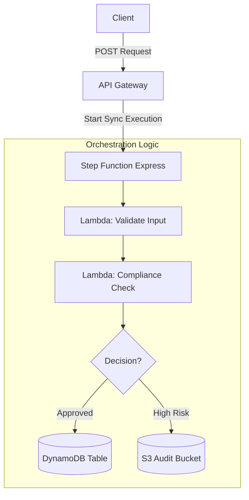

# Serverless Compliance Flow

A fully serverless microservice that ingests financial transactions, validates them against compliance rules using AWS Step Functions, and routes them to either **DynamoDB** (Approved) or **S3** (High Risk audit).

### Architecture



### Tech Stack

  * **IaC:** AWS CDK (TypeScript)
  * **Orchestration:** AWS Step Functions (Express Workflow)
  * **Compute:** AWS Lambda (Node.js/TypeScript)
  * **Storage:** DynamoDB (Active data) & S3 (Audit logs)

### Setup & Deploy

**1. Prerequisites**

  * AWS CLI configured (`aws configure`)
  * Node.js installed

**2. Installation**

```bash
npm install
```

**3. Deploy**

```bash
npx cdk bootstrap  # Run only once per region
npx cdk deploy
```

### Usage

**Scenario A: Approved Transaction (\< 10k)**
Result: Saved to DynamoDB.

```bash
curl -X POST \
  -H "Content-Type: application/json" \
  -d '{ "input": "{\"sender\": \"Alice\", \"amount\": 5000, \"currency\": \"EUR\"}" }' \
  YOUR_API_URL
```

**Scenario B: High Risk Transaction (\> 10k)**
Result: Archived to S3.

```bash
curl -X POST \
  -H "Content-Type: application/json" \
  -d '{ "input": "{\"sender\": \"Bob\", \"amount\": 15000, \"currency\": \"USD\"}" }' \
  YOUR_API_URL
```

### Cleanup

To remove all AWS resources and avoid costs:

```bash
npx cdk destroy
```
